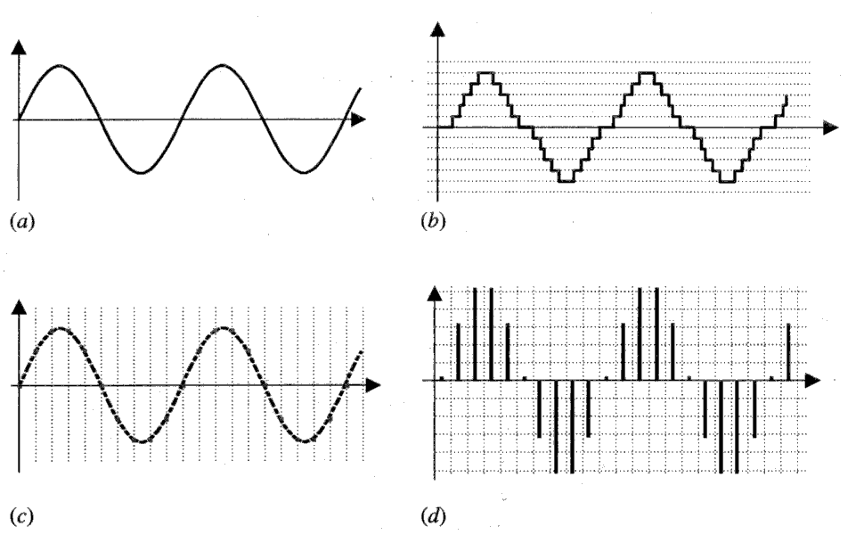
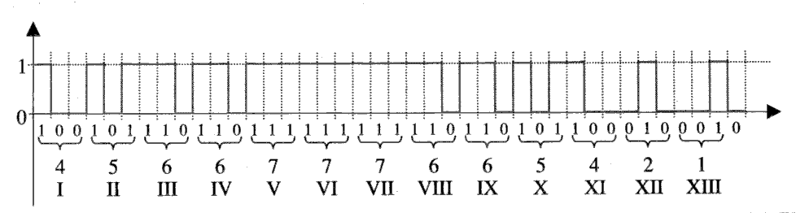

.. _audio:

Managing digital audio
======================

.. epigraph::

   Digital audio is like painting with numbers.
   
   -- Kim Cascone

According to physics, sound is a traveling vibration, i.e. a wave that moves through a medium such as air. The sound wave transfers energy from particle to particle until it is finally "received" by our ears and perceived by our brain. The two fundamental parameters to describe a sound are the amplitude (also known as volume) and the frequency (the measure of the number of oscillations of the wave per unit of time). :cite:`righini2009`

Recent technological growth has led to a marked improvement in the speed and density performance of circuits and memories, making it possible to digitally represent large amounts of data, including acoustic signals. Specifically, the digitization of sound has led to a series of transformations since the 1980s, which have affected both professionals and music users. From the introduction on the market of the first CD for commercial use in 1982 to today, we have witnessed the birth (and end) of numerous digital media (Digital Audio Tape, MiniDisc, USB, DVD, HDD, SSD, Cloud). :cite:`cipriani2013`

This has allowed the treatment and numerical processing of digital signals to take on a clear preponderance over the analog one: a sequence of numbers representing the amplitude of the signal at precise and discrete instants of time is much more precise and reliable than an approximation captured on a magnetic tape. :cite:p:`lombardovalle2008` Therefore, it was necessary to design systems capable of converting analog sound into a succession of values that describe the various parameters of sound such as pitch, intensity, and timbre. Observing the Cartesian representation of a sound wave in the time domain, it can be seen that the ordinate axis describes the amplitude (intensity), and the abscissa axis highlights the frequency at which the wave moves (pitch). The conversion of sound from analog to digital, therefore, takes place on the two aforementioned levels: we will speak of *sampling* for the frequency and *quantization* for the amplitude. The timbre is instead strictly related to the representation of the sound in the frequency domain, and it can usually be analyzed by applying a Fourier Transform to the digitized signal.

Sampling
--------
Sampling is the discretization of the analog signal over time. :cite:`lombardovalle2008`

In other words, sampling is used to convert the time-varying continuous signal into a discrete sequence of real numbers. :cite:`giannakopoulos2020` The interval between two successive discrete samples is the sampling period (:math:`T`). We will speak of sampling rate (:math:`sf = \frac{1}{T}`) as an attribute describing the sampling process.

Since the representation of the signal is given by the variation of the amplitude over time, sampling corresponds to the periodic identification of the presence of the signal on the abscissa axis. In detail, to be able to correctly describe a signal, it is necessary to sample at least one point in the positive phase and one in the negative phase, otherwise we would incur the loss of essential values for recreating the wave, and in the interpolation phase we would create signals not originally present or others would be lost. [#f1]_

Obviously the shorter the time intervals between one sample and the next, the more similar to the original analog the sampled sound will be. At the limit, for infinitely short time intervals, the digital signal will correspond to the real one. Generally speaking, it has been observed that to avoid the loss of information, the sampling must take at least two samples for the partial maximum frequency present in the signal (:math:`sf = 2 \times freq_{max}`). [#f2]_

   a Analogic signal. b Quantization. c Sampling. d Quantized and sampled.

Quantization
------------

Quantization is a critical step in the digital signal processing of audio signals. It involves discretizing a continuous-time signal, such as an audio waveform, by mapping each sample value to the nearest value in a set of discrete values int the :math:`y`-axis. The number of bits used to represent each quantized sample determines the resolution of the quantization process. The higher the number of bits used, the more accurate the approximation of the original signal will be.

In digital audio, the most common bit depth for quantization is 16 bits per sample, which provides :math:`2^{16}` possible levels of amplitude for each sample, in a range that varies from :math:`-2^{15}` to :math:`2^{15}` (1 bit used for the sign). This level of precision is sufficient for most audio applications, including music recording and playback. However, higher bit depths are used for specialized applications, such as audio mastering, where the goal is to preserve the maximum amount of dynamic range and detail in the original recording (standard bit encoding are: 16, 24 and 32).

Quantization can introduce errors into the audio signal, known as *quantization noise*. This noise is the difference between the original signal value and its quantized approximation. The amount of quantization noise depends on the number of bits used for quantization, with higher bit depths resulting in lower levels of quantization noise. :cite:`lombardovalle2008`
It is worth noting that the choice of the number of bits used for quantization can have a significant impact on the overall audio quality. If the bit depth is too low, the quantization error can introduce audible artifacts, such as distortion or noise. On the other hand, using a high bit depth can increase the size of audio files and require more processing power to handle the data.

The *Signal-to-Quantization-Noise-Ratio* (SQNR) is a measure of the quality of the signal based on the *quantization noise* that has been introduced during the digitization process: it measures the ration between the original signal power and the max amplitude that can be achieved by the quantization noise.

Pulse Code Modulation
---------------------

The final step of digitization, which incorporates the processes of quantization and sampling, is the generation of the code associated with the sample.

Digital audio signals are commonly encoded using PCM, with the linear pulse code modulation (LPCM) being the most widely used form. In LPCM, the continuous analog signal is first sampled at a specific rate, resulting in a discrete set of samples. These samples are then quantized into a series of numerical values that can be represented using a fixed number of bits, usually ranging from 8 to 32 bits per sample. The number of bits used per sample determines the dynamic range of the digital signal, with a higher number of bits resulting in a greater dynamic range and better signal-to-noise ratio.

To illustrate how PCM encoding works at a bit level, consider the following example. Suppose we have a PCM-encoded audio signal sampled at a rate of 44.1 kHz and quantized with 16 bits per sample. This means that for every second of audio, there are 44,100 sample points, with each sample represented by 16 bits. Each sample value represents the amplitude of the audio signal at that particular moment in time.

For instance, let's take a sample of the PCM-encoded audio signal at a specific time point, which has a value of 0110001011010101 in binary, or 16309 in decimal. This value represents the amplitude of the audio signal at that time point, with higher values indicating a louder sound and lower values indicating a quieter sound. The PCM-encoded signal can be decoded back into an analog signal by reversing the quantization and sampling process. In :numref:`pcm` you can see the graphical representation of PCM: the Roman numerals indicate the succession of samples, and for each sample (of 3 bits) there is a binary number which represents its amplitude.

PCM encoding is used in many digital audio formats, including the Waveform Audio File Format (.wav) and Audio Interchange File Format (.aiff). These formats use PCM encoding with various bit depths and sampling rates to store and transmit digital audio data. PCM encoding is also used in digital communication systems, such as digital telephone networks and digital television broadcasting. :cite:`cipriani2013`

.. _pcm:

   Pulse Code Modulation

.. _fft:

The frequency domain
--------------------

In addition to representing sound in the time domain, it is also possible to represent its properties in the frequency domain. This system was studied by Charles Fourier, who defined the process of converting from time domain representation to frequency domain representation, which is called the Fourier Transform (FT). When the starting signal is in digital format, the Discrete Fourier Transform (DFT) can be applied. The underlying idea behind the DFT is that the spectrum is sampled in frequency just as the digital waveform is sampled in time.

Mathematically speaking, the relationship between :math:`N` samples in the time domain :math:`x_0, x_1, ..., x_{N-1}` and :math:`N` complex numbers of the Discrete Fourier Transform :math:`X_0, X_1, ..., X_{N-1}` is described by the formula:

.. math::
   :label: fourier

   X_k = \sum_{n=0}^{N-1} x_n e^{-ik \frac{2 \pi}{N} n}\quad k=0,1,...,N-1

where :math:`i` is the imaginary unit, :math:`e^{\frac{2\pi}{N}}` is the :math:`N` -th root of unity, and :math:`k` is the frequency index. :cite:`wiki:Trasformata_discreta_di_Fourier`

Essentially, the complex numbers :math:`X_k` represent the amplitude and phase of different sinusoidal components of the input signal :math:`x_n`. The calculation of the sum requires :math:`O(N^2)` arithmetic operations, and to optimize the algorithm's performance, the Fast Fourier Transform (FFT) was developed :cite:`cormen`, which calculates the same result with a number of operations of :math:`O(N log(N))`, making the summation calculation much faster. In fact, the DFT and FFT algorithms are an essential element in digital signal analysis. :cite:`lombardovalle2008`

A case study: Audio Tapes
-------------------------

.. figure:: http://img.canuckaudiomart.com/uploads/large/1009879-studer-a807-commercial-reel-to-reel-tape-recorderplayer.jpg
   :alt: A807 Tape Recorder
   :align: center
   :width: 500

   Studer A807 Reel to Reel Tape Recorder.

The invention of magnetic tape for audio recordings dates back to 1928, when Fritz Pfleumer, a German inventor, created this innovative technology. Reel-to-reel audio tape recordings quickly became the primary recording format used by professional recording studios until the late 1980s, resulting in numerous sound archives preserving a large number of audio tapes.

However, like any analogue carrier, magnetic tape is also subject to physical degradation, which can be slowed down but not entirely prevented. Therefore, digitization becomes essential to prevent degradation that can render the information inaccessible. Additionally, magnetic tape is closely linked to its playback device: the reel-to-reel tape recorder. Before pressing the play button, the machine must be configured correctly to play back the recordings on the tape, and any error may cause audio alteration and the loss of the preservation copy's authenticity. :cite:`Micheloni2017AST`

Two main parameters must be configured for optimal playback: reel replay speed and equalization.

Regarding the equalization parameter, during the recording process, the source signal is modified by applying equalization that alters the frequency response (application of a pre-emphasis curve) to maximize the Signal-to-Noise Ratio (SNR) of the recorded signal. This alteration must be compensated for during the reading of the tape by juxtaposing an inverse curve (post-emphasis curve) to obtain the original audio signal. The main standards adopted are CCIR, also known as IEC1, mostly used in Europe, and NAB, alternatively called IEC2, mostly adopted in the USA. It is worth noting that curves of the same standard may differ according to the reel speed.

As per standard definitions, the equalizations are the product of two curves:

.. math::
   :label: preemphasis

   N(DB) = 10 \log \left(1 + \frac{1}{4\pi^2 f^2 t^2_2}\right) - 10 \log \left(1 + 4\pi^2 f^2 t^2_1\right)

where :math:`f` represents the frequency in Hz, and :math:`t_1` and :math:`t_2` are time constants measured in seconds. In CCIR, the curve shape is solely dependent on the constant :math:`t_1`, while :math:`t_2` is set to infinity. Moreover, the time constants alter concerning the tape speed. The equalization and tape speed must be appropriately set to achieve a flat frequency response. :cite:`10.1162/comj_a_00487`

Often, carriers do not indicate the speed and equalization standards, and lack of documentation may necessitate the operator to depend on auditory cues. However, previous experiments have demonstrated that this approach is prone to errors. :cite:`10.1162/comj_a_00487` To avoid subjectivity and potential errors that may compromise the preservation copy's accuracy, a software tool that can identify the correct equalization is the solution. This not only aids operators in the digitization process but also benefits musicologists who can verify the correctness of an unknown provenance digitized copy and rectify any mistakes if necessary.

.. rubric:: Footnotes

.. [#f1] The so-called phenomenon of aliasing or subsampling.

.. [#f2] This rule has been defined by the *Nyquist-Shannon sampling theorem* in 1949, even if it would be more correct to call it the Whittaker-Nyquist-Kotelnikov-Shannon (WNKS) theorem, according to the chronological order of those who have proved increasingly generalized versions of it . In any case, it follows that the standard sampling frequency is 44100 Hz, i.e. double 22050 Hz, which is the maximum frequency audible to the human ear (:cite:t:`lombardovalle2008`)
